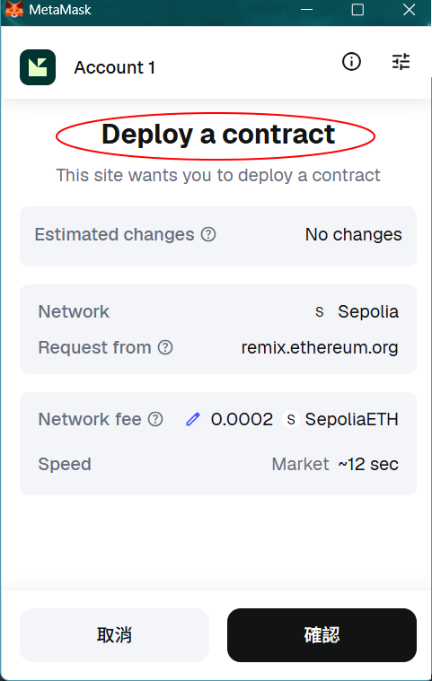
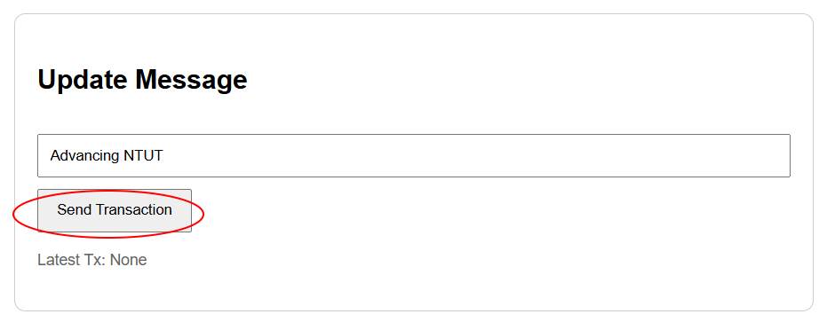
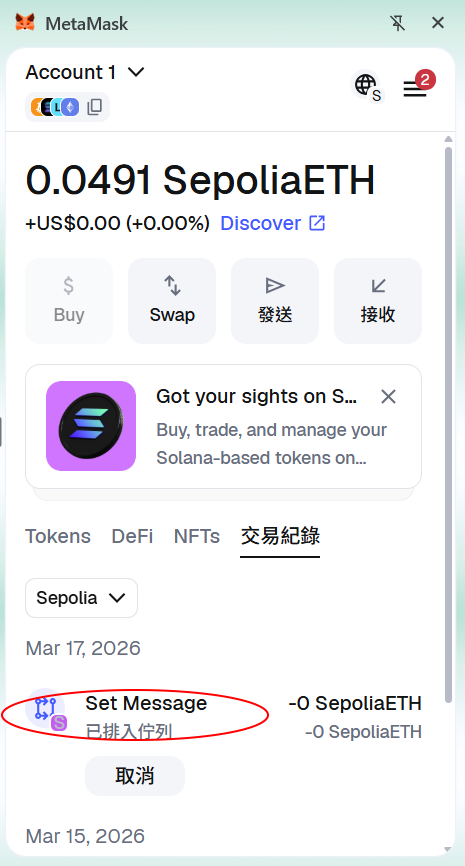

# Blockchain Message Board

# 區塊鏈留言板

**Author:** Liu Zijing\
**Major:** Department of Physics, National Kaohsiung Normal University

**作者：** 劉子敬\
**系所：** 國立高雄師範大學 物理學系

------------------------------------------------------------------------

# Project Overview

# 專題概述

This project implements a **decentralized message board (DApp)** using
an Ethereum smart contract.

Users can: - Write a message to the blockchain - Read the current
message stored on-chain

This demonstrates the basic workflow of a blockchain application:

Smart Contract → Deployment → Wallet Interaction → Web Interface.

本專題實作一個 **去中心化留言板 (Decentralized Application, DApp)**。

使用者可以：

-   將訊息寫入區塊鏈
-   從區塊鏈讀取訊息

本專題展示了區塊鏈應用的基本流程：

**智能合約 → 部署 → 錢包互動 → 網頁介面**

------------------------------------------------------------------------

# System Architecture

# 系統架構

User (Browser)\
│\
│ MetaMask Wallet\
│\
Frontend (HTML + JavaScript)\
│\
│ Web3 interaction\
│\
Ethereum Sepolia Testnet\
│\
Smart Contract (Solidity)

------------------------------------------------------------------------

# Technologies Used

# 使用技術

### Blockchain

-   Ethereum
-   Sepolia Testnet

### Smart Contract

-   Solidity 0.8.x
-   Remix IDE

### Wallet

-   MetaMask

### Frontend

-   HTML
-   JavaScript
-   Ethers.js / Web3 interaction

------------------------------------------------------------------------

# Smart Contract

### Contract File

`MessageBoard.sol`

### Functions

#### setMessage

`setMessage(string memory _msg)`

Write a message to the blockchain.\
將留言寫入區塊鏈。

#### getMessage

`getMessage()`

Return the current message stored on-chain.\
讀取目前區塊鏈上的留言。

------------------------------------------------------------------------

# Contract Address

# 合約地址

Sepolia Testnet:

`0xd7c8A9366Bd849990be3Fb42f49B4ff3A0D49518`

View the contract on **Etherscan**.\
在 **Etherscan** 上查看智能合約。

https://sepolia.etherscan.io/address/0xd7c8A9366Bd849990be3Fb42f49B4ff3A0D49518

------------------------------------------------------------------------

# How to Run the Project

# 專題實現步驟

## Step 1

Open Remix IDE

開啟 Remix IDE

https://remix.ethereum.org

## Step 2

Create Solidity file

建立 Solidity 檔案

`MessageBoard.sol`

## Step 3

Compile contract

編譯智能合約

Solidity 0.8.x

## Step 4

Connect MetaMask

連接 MetaMask 錢包

Network:

Sepolia Testnet

## Step 5

Deploy contract

部署智能合約

## Step 6

Write message

寫入留言

`setMessage("Hello NTUT")`

Confirm the transaction in MetaMask.\
在 MetaMask 中確認交易。

## Step 7

Read message

讀取留言

`getMessage()`

or

`message()`

Expected output:

`Hello NTUT`

------------------------------------------------------------------------

# Web Interface

# 網頁介面

This project also includes a simple **web interface** that allows users
to interact with the smart contract through MetaMask.

本專題也包含一個簡單的 **網頁介面**，可以透過 MetaMask 與智能合約互動。

Functions supported:

-   Connect MetaMask
-   Read blockchain message
-   Update blockchain message

------------------------------------------------------------------------

# Screenshots

# 系統畫面

### Smart Contract Deployment

### 智能合約部署

### Write Message

### 寫入訊息

### 交易佇列

### Read Message

### 讀取訊息

------------------------------------------------------------------------

# Learning Outcomes

# 學習成果

Through this project, we learned:

-   How to write a Solidity smart contract
-   How to deploy a contract to Ethereum testnet
-   How to interact with blockchain through MetaMask
-   How to connect a web interface with a smart contract

透過本專題，我們學習到：

-   Solidity 智能合約撰寫
-   智能合約部署到 Ethereum 測試網
-   透過 MetaMask 與區塊鏈互動
-   網頁前端與智能合約的整合

------------------------------------------------------------------------

# Future Improvements

# 未來改進

Possible extensions include:

-   Multi-user message board
-   Store multiple messages
-   Add message history
-   Build a complete DApp frontend
-   Deploy to Ethereum mainnet

未來可以擴展：

-   多人留言板
-   儲存多筆留言
-   留言歷史紀錄
-   完整 DApp 前端
-   部署到 Ethereum 主網

------------------------------------------------------------------------

# License

# 授權

MIT License
